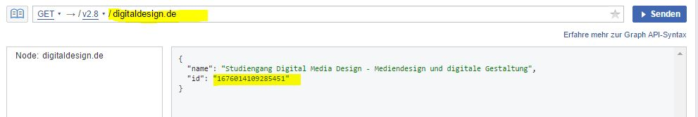

# Kirby FacebookEvents


This plugin does one simple thing: Using the Facebook Graph API to get events from a Facebook page.

## Changelog

* v1.0.0 - First release
* v2.0.0 - Added asynchronous call functionality
* v2.0.1 - Implemented Facebooks API change for event sorting (newest to oldest instead of oldest to newest)

## Preview

If you did everything allright you should be able to make an API call for any given Facebook page ID. Your result could look like this: Using the handsome starterkit


## Installation

Download or clone this project into the plugins folder of your project. Make sure to rename the folder to `FacebookEvents`. It should look like this:

```php
  site/plugins/FacebookEvents
```

## Setting things up

#### 1. Add entry to config.php

First things first. You need to specify a snippet path in your config file. This snippet will act as a template and renders the content according to the markup.

```php
  // config.php
  c::set("facebookEventsTemplate", "your/snippet/file")
```

Just take a look at the example files provided in the plugins example folder. See Section [Example files](#example-files)

#### 2. Include javascript for asynchronous call

Next you need to include a little javascript file. You can place it in the header of your webpage if you have some sort of one-page layout. Otherwise you should include it on the page where the Facebook-Events should get displayed. This script will take care that the content gets loaded asynchronous via Ajax.

```php
  js('assets/plugins/FacebookEvents/js/facebookEvents.js', true)
```

(Optional) There is also a basic css file included. Feel free to use it or just style the content yourself. It's Up to you.

```php
  css('assets/plugins/FacebookEvents/css/news.css')
```

#### 3. Provide a HTML element

In step 1 you used the `config.php` file to set a snippet as template. This will get used to render the content and returns the html that you want to show on your webpage. But in order to do that it needs to get a place somewhere on your webpage. 

```html
  <span id="fb-news"></span>
```

Just put an HTML element with this ID on your webpage where you want the content to get rendered. This could be in your `home` template or anywhere else.

## Getting started

### Get a Facebook Access Token

For the plugin to work you need access to the Facebook API. Unfortunately Facebook has removed unauthenticated access to the Graph API for pages. You'll need to create an application at [Facebook](https://developers.facebook.com/) to obtain an access token.

I think you could also create a temporary token via the [Graph API Explorer](https://developers.facebook.com/tools/explorer) but this one will expire after 1 hour.

You can obtain a longer living access token if you use this link with your AppId and AppSecret `https://graph.facebook.com/oauth/access_token?client_id=YOUR_APP_ID&client_secret=YOUR_APP_SECRET&grant_type=client_credentials`

### Get a Facebook Page ID

Next to display the events from some page you need it's page ID. You can obtain that ID using the [Graph API Explorer](https://developers.facebook.com/tools/explorer) and enter the pages name there. Like this:



### Enter your credentials for API calls

In order to make API calls to Facebook you need to enter your credentials in the access token field located in: `site/plugins/FacebookEvents/credentials/credentials.json`

## Usage

Requesting the data is really simple: Example code (from example/event.php). The requested pictures of the event will get saved into your `$page` objects content folder. On further requests they then will get shared from your local storage.

```php
  // provide a $page object. The requested pictures will be stored in that page
  $fbe = FacebookEvents($page);

  // and enter the id of the related facebook page.
  // You can obtain the events sorted by their starting date 'ascending' (default value) or 'descending'.
  $events = $fbe->getFacebookEvents('1676014109285451', 'asc');
```

Now you can request a specific event or just loop through all of them. Your choice:

```php
// loop through all events:
<?php for($i = 0; $i < count($events); $i++): ?>
  <?php $fb_event = $fbe->getEvent($events, $i); ?>
    <div>
      <h3><?php echo $fb_event->name() ?></h3>
      <p><?php echo kirbytext($fb_event->description()) ?></p>
    </div>
<?php endfor ?>
```

By default if no index is given you will obtain the next event with the nearest `start_date` until today.

```php
// or just fetch a single event
<?php $fb_event = $fbe->getEvent($events); ?>
<div>
  <h3><?php echo $fb_event->name() ?></h3>
  <p><?php echo kirbytext($fb_event->description()) ?></p>
</div>

```

You can access specific events by their index. If you access an invalid index (e.g. because that event does not exist), an error will be thrown.

```php
// or just fetch a single event
<?php $fb_event = $fbe->getEvent($events, 2); ?>
// if you just need the first
<?php $fb_event = $fbe->getEvent($events); ?>

```

## Available fields

This are available to you after a successful API call. Some fields can be empty if they got not filled in over on Facebook.

| field                 | description                                      | type     |
| --------------------- |:------------------------------------------------:|:--------:|
| id                    | a Facebook event ID                              | string   |
| name                  | name of the event                                | string   |
| cover                 | The cover image source URL                       | string   |
| description           | event description                                | string   |
| event_url             | facebook event url                               | string   |
| place                 | array containing all the place information       |   [ ]    |
| place_city            | the events location                              | string   |
| place_street          | the events street                                | string   |
| end_date              | array with fields: `['date', 'time', 'day', 'month', 'year', 'raw_date']` | [ ] |
| start_date            | array with fields: `['date', 'time', 'day', 'month', 'year', 'raw_date']` | [ ] |
| start_date_humanized  | date in format: 'l, d.m.Y' => 'Sunday, 13.11.2016'     | string |
| start_date_month      | month in format: 'M' => Feb                            | string |
| start_date_day        | day in format: 'd' => 07                               | string |
| start_date_year       | year in format: 'Y' => 2016                            | string |
| start_date_time       | time in format: 'i:s' => 12:00                         | string |
| start_date_raw        | raw date format: 'Y-m-d i:s:00' => 2017-02-17 19:00:00 | string |

The field `place` of type array does contain the same data such as `place_city` and `place_street`.

Same goes for `start_date` and `end_date` which do contain all of the fields of `start_date_humanized`, `start_date_month`, `...` etc.

You can pass the description over to Kirbytext, to get some nice formating:

```php
  <p><?php echo kirbytext($fb_event->description()) ?></p>
```

## Example files

To get you a heat start there are is an example `event.php` snippet located in `site/plugins/FacebookEvents/example/snippets/`. You can copy that to your projects snippet folder and call it in e.g. `templates/home.php`. You can also find an example css styling file in `assets/css`

## Future improvements

- [x] Make call asynchronous (v2.0.0)

## License


<https://creativecommons.org/licenses/by-sa/4.0/>
